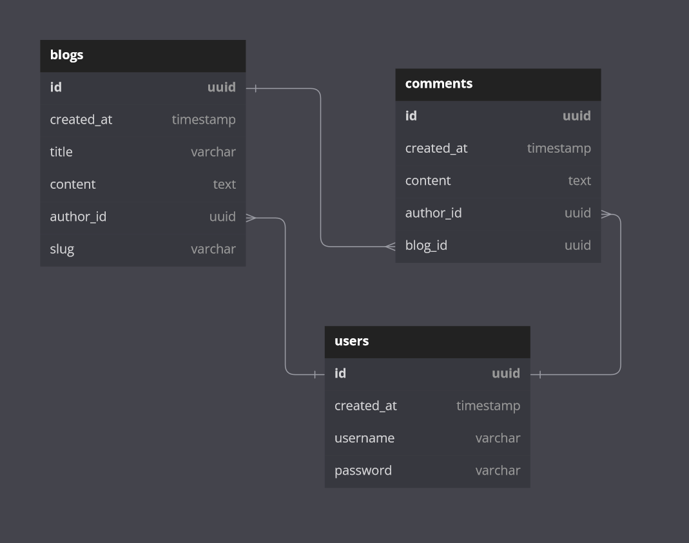

# Defining our domain

With our dev environment in place, let's get to the fun part: building!

Behind every great data-driven web service is an even better domain model. Our domain in this case is a blog engine and all the nitty gritty detail that goes into modeling a blogging website in terms of objects in code.

As with any blogging engine, we'll end up having:

1. **Blogs** - each of which will have a title, content, and time of the creation

2. **User profiles** - each of which will consist of a username, password, time of creation, and blog posts they've authored

and lastly, for a bit of relational data spice,

3. **Blog comments** - each of which will be associated with a blog and a user

So... what will these concepts look like in terms of code?

Starting at the most atomic layer of our stack, the database, we can see we'll need at least a few tables to house blog, comment, and user data. Pretty straightforward, we'll need to create the following tables:

- `users` with the associated properties:
  - `id` - a string UUID as our primary key
  - `created_at` - a UTC timestamp of the blog's creation date
  - `username` - a **unique** limited-length text field
  - `password` - a limited-length text field... that's **not** plain text

- `blogs` with the associated properties:
  - `id` - a string UUID as our primary key
  - `created_at` - a UTC timestamp of the blog's creation date
  - `title` - a limited-length text field
  - `content` - a max-length text field
  - `author_id` - a foreign key relation to the `users` table
  - `slug` - a public-facing identifier generated based on the blog title

- `comments` with the associated properties:
  - `id` - a string UUID as our primary key
  - `created_at` - a UTC timestamp of the blog's creation date
  - `content` - a limited-length text field
  - `author_id` - a foreign key relation to the `users` table
  - `blog_id` - a foreign key relation to the `blogs` table

Our schema should look roughly like the following:

One user can have many blogs, one blog can have many comments, and one user can author many comments. We'll keep our schema simple for now, limiting ourselves to just one-to-many relationships.

Our Rust code should reflect the data we'll be working with outlined above, including `struct`s to house data pulled out of the database in various forms and response models our UI code can consume to display on a web page.

With a good idea of **how** we'll store the data needed to power our blog, we should probably figure out **where** we'll store our data.

Thanks to the advances of modern data-based (no pun intended) SaaS platforms, we have our pick of the litter in terms of on-prem and cloud-hosted data services. As we're using Docker, we're naturally inclined to spin up yet another Docker container to host a Postgres instance for development and testing. 

We'll also need someplace to put data in production, and unfortunately, a Docker-hosted Postgres instance won't suffice. To spice things up a bit, we'll use [PlanetScale](https://planetscale.com/) to manage both our development and production databases.
