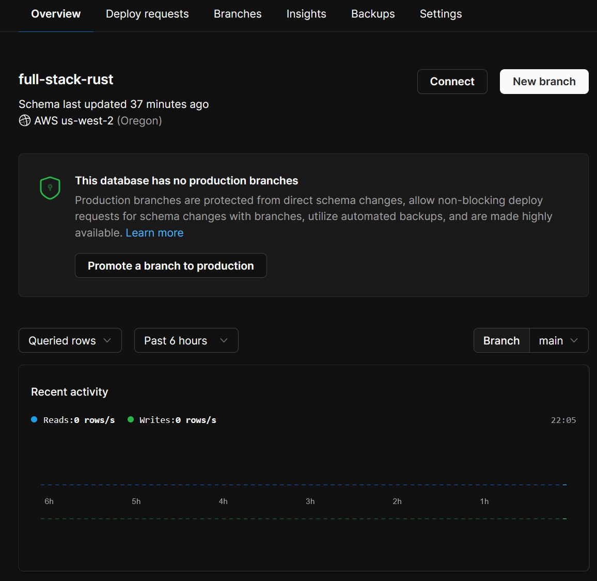

# Setting up PlanetScale

With [PlanetScale](https://app.planetscale.com/joeymckenzie), we can manage our databases in a serverless fashion in a similar fashion to how we manage our code. PlanetScale offers the option to develop our database like we develop our code with branches, allowing us to follow a [trunk-based approach](https://trunkbaseddevelopment.com/) as we update, manage, and release changes to our database.

In short, PlanetScale will allow us to:

- Host a production database on our `main` branch
- Host a development/test database on our `dev` branch
- Make changes to our schema on our `dev`
- Merge those changes into our `main` branch

For many of us, this is a familiar workflow when working with source code - let's do the same with our databases!

Setting up an account with PlanetScale is fairly simple. Go to the website, sign up for an account, and create your first database for free once you're directed to your dashboard.

> Disclaimer: I'm not endorsed by PlanetScale, I simply love their platform and prefer it for my personal projects

Create a database, and once PlanetScale is finished setting everything up, we should be presented with a basic dashboard:

Sweet! Go ahead and grab a copy of your database's connection string by hitting the `Connect` button. Next, create a new branch named `dev`, and again, copy the credentials - these are different from the `main` branch!

PlanetScale doesn't allow direct schema alteration on the `main` branch and instead encourages us to make changes to our `dev` and "merge" them into our `main` branch database. Pretty neat, huh?

With your credentials copied into a scratch pad (that you hopefully won't forget!), let's start writing some code to set up our schema programmatically.
