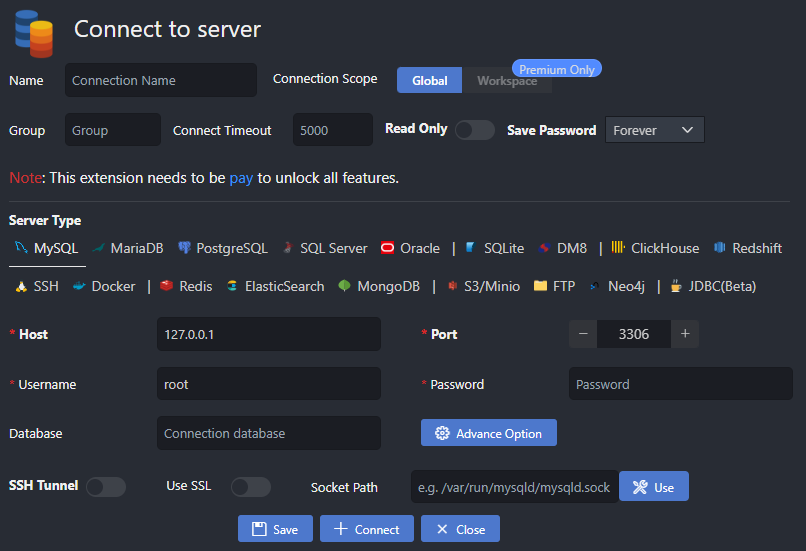
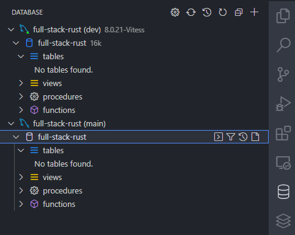
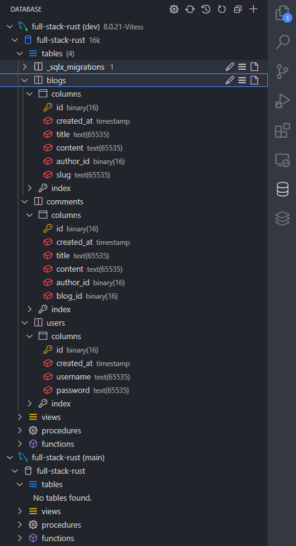

# Adding migrations

With our `blog-core` crate in place, let's add the necessary dependencies we'll need to help facilitate our persistence logic. Since we'll be using sqlx for migrations and thanks to our dev container setup with the sqlx-cli ready to roll, we can start writing some code! Let's initialize an empty migration that we'll use to create some tables.

Since we've placed our `blog-core` library in a subdirectory, we'll need to run our sqlx migration commands from that subdirectory. That's a task will more than likely run multiple times, so let's lean on [`cargo-make`](https://github.com/sagiegurari/cargo-make) to define a runnable task to add migrations while working in the root directory of our project. We've already installed the CLI as we've included it in our dev container definition, all we need now is to add a [`Makefile.toml`](https://github.com/JoeyMckenzie/full-stack-rust/blob/main/Makefile.toml) to our repository root:

```toml
[env] ## tells cargo make that we're in the context of a Cargo workspace
CARGO_MAKE_EXTEND_WORKSPACE_MAKEFILE = true

[config] ## we want most/all of our tasks to run in the context of a workspace
default_to_workspace = false

[tasks.add-migration]
cwd = "crates/blog-core"
command = "sqlx"
args = ["migrate", "add", "${@}"]
```

Task runners are great tools for projects that have multiple dependencies with CLIs, various tools, etc. as they allow us to funnel all the different CLI commands we'll use through a project's lifetime into a single tool. Rather than having to memorize CLI commands for a specific tool, we can define it once with our `Makefile.toml` and call `cargo make [some_command]` to do the heavy lifting for us. Cool!

With our `add-migration` command, let's pass in a migration name thanks to the `${@}` argument in our `args` array. From the root of our project:

```bash
$ cargo make add-migration add_initial_blog_tables
[cargo-make] INFO - cargo make 0.36.4
[cargo-make] INFO - Build File: Makefile.toml
[cargo-make] INFO - Task: add-migration
[cargo-make] INFO - Profile: development
[cargo-make] INFO - Running Task: legacy-migration
[cargo-make] INFO - Execute Command: "sqlx" "migrate" "add" "add_initial_blog_tables"
Creating migrations/20230202000038_add_initial_blog_tables.sql

Congratulations on creating your first migration!

Did you know you can embed your migrations in your application binary?
On startup, after creating your database connection or pool, add:

sqlx::migrate!().run(<&your_pool OR &mut your_connection>).await?;

Note that the compiler won't pick up new migrations if no Rust source files have changed.
You can create a Cargo build script to work around this with `sqlx migrate build-script`.

See: https://docs.rs/sqlx/0.5/sqlx/macro.migrate.html
[cargo-make] INFO - Build Done in 0.51 seconds.
```

We should now see a `/migrations` folder in our `blog-core` crate with one empty SQL file (your timestamp will look a bit different than mine). Before we add the SQL to generate our tables, let's take a look at the current state of our database. Since I'm using VS Code, I'll rely on Weijan Chen's awesome database management tool so I can peek at PlanetScale from the comfort of my current editor rather than swapping between tools.

Once installed, we should the following when clicking on the database icon on our VS Code tool panel:



Now it's just a matter of punching in our PlanetScale credentials and connecting to the database. Hopefully, you saved your `dev` and `main` branch credentials for safekeeping as we'll extract the necessary information from the connection string to set up a database profile in VS Code. A typical MySQL connection string will look like `mysql://{username}:{password}@{server}/{database}` - I'll leave it up to the reader to extract the important parts and save the connection.

> PlanetScale requires connection to your database over SSL, so be sure to check the option for secure connections with your SQL tool of choice

Once connected, I suggest naming your connection after the database and environment you're connected - for our case, that would look something like `full-stack-rust (dev)`. Let's add a connection to our `main` branch database as well while we're add it. Similar to the above, locate your connection string to the `main` branch and punch in the credentials. Once we've connected, our console should look something like this:



Sweet, our connections are in place and we're ready to write some SQL! Recall the schema we'll need to create initially from [defining our domain](./1-defining-our-domain.md) - let's write the SQL to model the tables we need to create. In your migration file:

```sql
-- Add migration script here

CREATE TABLE
    users (
        id BINARY(16) PRIMARY KEY,
        created_at TIMESTAMP NOT NULL DEFAULT CURRENT_TIMESTAMP,
        username TEXT NOT NULL,
        password TEXT NOT NULL
    );

CREATE TABLE
    blogs (
        id BINARY(16) PRIMARY KEY,
        created_at TIMESTAMP NOT NULL DEFAULT CURRENT_TIMESTAMP,
        title TEXT NOT NULL,
        content TEXT NOT NULL,
        author_id BINARY(16) NOT NULL,
        slug TEXT NOT NULL,
        KEY author_id_idx (author_id)
    );

CREATE TABLE
    comments (
        id BINARY(16) PRIMARY KEY,
        created_at TIMESTAMP NOT NULL DEFAULT CURRENT_TIMESTAMP,
        title TEXT NOT NULL,
        content TEXT NOT NULL,
        author_id BINARY(16) NOT NULL,
        blog_id BINARY(16) NOT NULL,
        KEY author_id_idx (author_id),
        KEY blog_id_idx (blog_id)
    );
```

Before we run migrations, as we _may_ evolve our schema over time, let's update our `Makefile.toml` to include a sqlx migration command:

```toml
[env] ## tells cargo make that we're in the context of a Cargo workspace
CARGO_MAKE_EXTEND_WORKSPACE_MAKEFILE = true

[config] ## we want most/all of our tasks to run in the context of a workspace
default_to_workspace = false

[tasks.add-migration]
cwd = "crates/blog-core"
command = "sqlx"
args = ["migrate", "add", "${@}"]

[tasks.migrate]
cwd = "crates/blog-core"
command = "sqlx"
args = ["migrate", "run"]
```

We'll need to inform sqlx of our database connection string, and have a few ways of doing this:

1. Define a `.env` file at the root of our project with our PlanetScale connection string assigned to a `DATABASE_URL` environment variable
2. Pass in a `--database-url` flag to the `sqlx migrate` command

Since we'll need sqlx to read from the connection string multiple times, let's go with option 1. Now with you `.env` file in place and your `DATABASE_URL` set to your `dev` branch connection string, let's run `cargo make migrate` in our terminal. We should see something along the lines of:

```bash
$ cargo make migrate
[cargo-make] INFO - cargo make 0.36.4
[cargo-make] INFO - Build File: Makefile.toml
[cargo-make] INFO - Task: migrate
[cargo-make] INFO - Profile: development
[cargo-make] INFO - Running Task: legacy-migration
[cargo-make] INFO - Execute Command: "sqlx" "migrate" "run"
Applied 20230202000038/migrate add initial blog tables (648.712977ms)
[cargo-make] INFO - Build Done in 2.50 seconds.
```

...and in our MySQL console:



We have tables! With our initial database schema in place, let's flesh out our next component in our vertical slice - the API.
